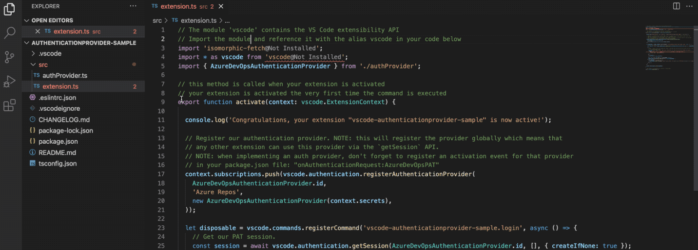

# Javascript Pie - convert Javascript to Python using Codex

Select some javascript and convert it to Python using Codex

## Demo

## Running the example

- Open this example in VS Code 1.47+
- Open media/main.js
- change `"OPENAI_KEY"` to your own API Key from OpenAI
- `npm install`
- `npm run watch` or `npm run compile`
- `F5` to start debugging

Run the `Convert Javascript to Pie (Python)!` command to create the webview and get responses.

## Credits

This repository was forked from the (VSCode Webview Sample)[https://github.com/Microsoft/vscode-extension-samples]
